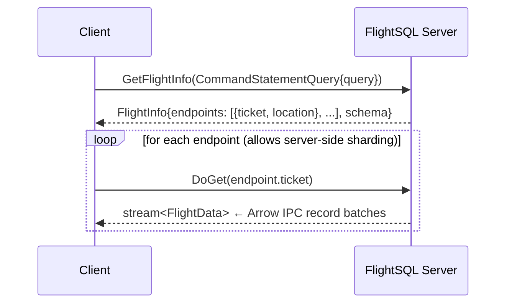

# Arrow Flight SQL in the Postgres ecosystem — background

> Status: **background reading**, not a design proposal.
> Primary source: [github.com/apache/arrow-flight-sql-postgresql][afs-pg]
> (Apache-2.0, C++, 108★, last release 0.2.0 on 2024-04, active maintenance
> 2025–2026 — packaging/CI commits within the last week as of writing).
> Companion sources: [Arrow Flight SQL protocol spec][flight-sql-spec],
> [Introducing Arrow Flight SQL][flight-sql-blog] (Apache Arrow blog,
> Feb 2022).
> Sibling docs: [omnigres.md](omnigres.md), [pg_background.md](pg_background.md)

This document is a **reading companion** for the Arrow Flight SQL protocol
and its in-process Postgres implementation, written from the perspective of
someone considering a Flight SQL listener for `pg_transport`. It is *not*
a design proposal — that would belong under
[design/deferred/](../design/deferred/) if and when the framework decides to
take Flight SQL on as a target.

The structure mirrors [omnigres.md](omnigres.md): what the system is, where
its code lives, the architectural primitives that matter, and what we'd
borrow vs. rebuild if we ever shipped a Flight transport.

---

## 1. What Arrow Flight SQL is, in one paragraph

**Arrow Flight SQL** is a protocol — defined in `FlightSql.proto` — for
executing SQL queries and shipping the results as Apache Arrow record
batches over **gRPC** (HTTP/2 + Protobuf). It is built on top of the lower-
level [Arrow Flight][flight-spec] RPC framework, which supplies the wire
encoding for record batches, authentication middleware, and a
parallel/sharded `DoGet` model. Flight SQL adds a JDBC/ODBC-equivalent
surface on top: `CommandStatementQuery`, `CommandPreparedStatementQuery`,
`ActionCreatePreparedStatementRequest`, catalog/schema/table discovery
commands, transactions, savepoints, and a `CommandStatementIngest` bulk-
load path. The headline performance claim (Dremio, 2022) is **~20× over
ODBC/JDBC** on wide analytical scans, because the server emits columnar
Arrow buffers that the client maps directly into its in-memory format
with no per-cell decode.

The protocol is **not** a transport-layer optimisation of pgwire — it
is a parallel-universe wire that replaces the entire client surface.
A Flight SQL server and a pgwire server can coexist in the same backend
process but they share no bytes on the wire.

---

## 2. Where Flight SQL lives in the Arrow ecosystem

```
apache/arrow                              ← protocol definitions + C++/Java/Go libs
├── format/Flight.proto                   ← base Flight RPC
├── format/FlightSql.proto                ← Flight SQL command messages
├── cpp/src/arrow/flight/sql/             ← C++ client + server-base
│   ├── client.h                          ← FlightSqlClient
│   ├── server.h                          ← FlightSqlServerBase (abstract)
│   └── example/sqlite_server.cc          ← reference impl over SQLite
└── java/flight/flight-sql/               ← Java client + server-base

apache/arrow-flight-sql-postgresql        ← the actual PG extension we care about
└── src/afs.cc                            ← single 4400-line C++ file: the whole thing

apache/arrow-adbc                         ← columnar client driver layer
└── c/driver/flightsql/                   ← ADBC driver that speaks Flight SQL
```

**`FlightSqlServerBase`** (`cpp/src/arrow/flight/sql/server.h`) is the
abstract C++ class that all server implementations subclass. It dispatches
gRPC requests to virtual methods like `GetFlightInfoStatement`,
`DoGetStatement`, `CreatePreparedStatement`, `DoPutCommandStatementUpdate`.
A new backend just implements those methods.

**ADBC** (Arrow Database Connectivity) is the *client* analog of
JDBC/ODBC but Arrow-native. The `adbc_driver_flightsql` driver implements
ADBC against any Flight SQL server, so a Python/R/C++/Java client gets
columnar `RecordBatch`es out of `connection.execute("SELECT …")` without
touching pgwire. There's also `adbc_driver_postgresql` that speaks
**pgwire** directly and converts to Arrow inside the client process — same
client surface, completely different wire.

---

## 3. The protocol — RPC anatomy of a query

The Flight SQL request lifecycle for an ad-hoc query
([source][flight-sql-spec]):



The protocol-design points worth noting:

| Aspect | Mechanism |
|---|---|
| **Query submission** | `GetFlightInfo` with a `CommandStatementQuery` (serialized into the FlightDescriptor's `cmd` field) |
| **Result routing** | Server returns N `FlightEndpoint`s, each with an opaque `Ticket`. Clients fetch them in parallel via `DoGet`. Enables horizontal scaling: shards of one logical result can come from N nodes. |
| **Result shape** | `DoGet` returns a stream of `FlightData` messages, each carrying an Arrow IPC-encoded record batch (columnar, with `Schema` prepended). |
| **Prepared statements** | `DoAction(ActionCreatePreparedStatementRequest)` returns an opaque handle + parameter/result `Schema`. Subsequent `DoPut(CommandPreparedStatementQuery, params)` binds the parameters; then `GetFlightInfo` executes. |
| **Bulk ingestion** | `DoPut(CommandStatementIngest)` streams Arrow batches from client → server with `TableDefinitionOptions` for create/replace/append semantics. |
| **Cancellation** | `DoAction(CancelFlightInfo)` — out-of-band on the same gRPC connection, not a separate TCP conn (contrast pgwire's `CancelRequest`). |
| **Auth** | Flight middleware. The PG adapter uses `HeaderAuthServerMiddleware` with HTTP-Basic over TLS, reusing PG's `check_password()`. |
| **Sessions** | `SetSessionOptions` / `GetSessionOptions` / `CloseSession`, persisted via RFC 6265 cookies by default. |
| **Transactions** | `ActionBeginTransactionRequest` / `ActionEndTransactionRequest` return opaque transaction IDs that subsequent commands can attach to. Savepoints are similar. |

The protocol is intentionally JDBC/ODBC-shaped — there is a separate
"Flight SQL JDBC driver" that wraps a Flight SQL client and exposes a
standard JDBC `ResultSet`, demonstrating that the Flight SQL surface is
strictly richer than JDBC and reduces back to it cleanly.

---

## 4. `apache/arrow-flight-sql-postgresql` — architecture deep-dive

This is the only **in-process** Flight SQL implementation for Postgres
I'm aware of. Everything else is an external bridge. The entire
extension lives in **one 4400-line `src/afs.cc`** plus build scaffolding.

### 4.1 Process model — three tiers

The README and docs are thin; the actual architecture is in the code.
There are **three distinct bgworker roles** ([afs.cc:2387+][afs-mainproc]):

```
postmaster
  │
  ├─ MainProcessor   (1 bgworker, started by shared_preload_libraries _PG_init)
  │    purpose: own shared memory, supervise Proxy lifecycle
  │
  ├─ Proxy           (1 bgworker)
  │    purpose: host the gRPC Flight SQL server, accept connections,
  │             route per-session work to Executors via shared-memory ring
  │    contains: FlightSQLServer (subclass of FlightSqlServerBase)
  │    runs PG API only from its main thread; gRPC threads queue work
  │    via a signal-driven request queue (see signaled() handler)
  │
  └─ Executor        (N bgworkers, one per Flight session)
       purpose: actually run SPI_execute on behalf of one Flight session
       calls: BackgroundWorkerInitializeConnection(db, user, 0)
              SPI_connect / SPI_execute / SPI_prepare
       writes: Arrow record batches into a SharedRingBufferOutputStream
               that the Proxy reads back into the gRPC response stream
```

The header comment in `afs.cc` is unusually explicit about the
threading model:

> ```cpp
> // API isn't thread safe and must be called only in the main thread.
> // If we need to call PostgreSQL API from gRPC threads, we need to
> // create a request and process it in signaled().
> ```
> ([afs.cc:2387][afs-mainproc-comment])

This is the same constraint we hit in `pg_transport`: PG's API is
longjmp-based and process-singleton, so any tokio/gRPC thread that
wants to touch SPI has to marshal the request back to a "PG-safe"
thread. Flight SQL's solution is **one PG backend per session**
(an Executor bgworker), pinned for the session's lifetime.

### 4.2 Concurrency — answers our "single-threaded bgworker" question

The Proxy bgworker hosts the gRPC server on a single OS thread + Arrow
Flight's gRPC runtime. **gRPC threads do not call PG APIs** — they push
requests onto a queue, signal the Proxy's main loop, and the main loop
dispatches them via shared memory to Executor bgworkers.

Real concurrency comes from spawning N **Executor bgworkers**, one per
Flight session. Each Executor is a full PG backend (with its own
transaction state, snapshot, resource owner) that runs queries serially
on behalf of one session. This is structurally identical to one
PG connection = one backend, just with Flight SQL framing instead of
pgwire framing.

The "single Proxy + N Executors" pattern is the same shape as
`pg_transport`'s "single listener + N slot bgworkers", just with a
different IPC mechanism (SharedRingBuffer in DSA vs our SCM_RIGHTS
handoff or shm_mq general path).

### 4.3 Inter-process communication — `SharedRingBuffer`

Proxy ↔ Executor traffic flows through a **shared-memory ring buffer**
allocated via PG's Dynamic Shared Areas (DSA). The relevant types:

- `SharedRingBuffer` — the ring itself, in shared memory
- `SharedRingBufferInputStream` — Arrow `io::InputStream` wrapper
- `SharedRingBufferOutputStream` — Arrow `io::OutputStream` wrapper

This means the Executor writes Arrow IPC-encoded record batches directly
into the ring, and the Proxy reads them back as `arrow::io::InputStream`
without intermediate copies. The gRPC `DoGet` response then streams those
record batches to the client. The pattern is essentially:

```
Executor: SPI_execute → tupdesc → ArrowArrayBuilder per column → RecordBatch
       → arrow::ipc::StreamWriter → SharedRingBufferOutputStream → ring
                                                                     │
                                                                     ▼
Proxy:  SharedRingBufferInputStream → arrow::ipc::StreamReader →
       arrow::flight::RecordBatchStream → gRPC DoGet stream → client
```

Two **memory copies** per row:
1. PG executor → SPI tuptable (PG's own tuple format)
2. SPI tuptable → Arrow builder → record batch

The wire side (Arrow IPC → SharedRingBuffer → Flight stream → gRPC) is
fundamentally one materialisation that's then sliced into gRPC frames.
No row-by-row decode/re-encode like pgwire bridges suffer.

### 4.4 Query path — `SPI_execute` + per-column `ArrowArrayBuilder`

The `select` path ([afs.cc:1897+][afs-select]):

```cpp
class Executor : public WorkerProcessor {
  void select() {
    // ...
    ScopedSnapshot scopedSnapshot;
    SetCurrentStatementStartTimestamp();
    SPI_connect();
    auto result = SPI_execute(query.c_str(), true, 0);   // read-only SPI
    if (result > 0) {
      write_record_batches(tag);                          // tupdesc → Arrow
    }
    // ...
  }
};
```

Then `write_record_batches` ([afs.cc:1932][afs-wrb]):

```cpp
arrow::Status write_record_batches(const char* tag) {
    SharedRingBufferOutputStream output(this, localSession_);
    std::vector<std::shared_ptr<arrow::Field>> fields;
    for (int i = 0; i < SPI_tuptable->tupdesc->natts; ++i) {
        auto attribute = TupleDescAttr(SPI_tuptable->tupdesc, i);
        ARROW_ASSIGN_OR_RAISE(auto type,
                              ArrowArrayBuilderBase::arrow_type(attribute));
        fields.push_back(arrow::field(NameStr(attribute->attname),
                                      std::move(type),
                                      !attribute->attnotnull));
    }
    auto schema = arrow::schema(fields);
    // ...build RecordBatch in MaxNRowsPerRecordBatch-sized chunks...
}
```

`ArrowArrayBuilderBase` is the adapter layer that maps PG type OIDs to
Arrow types and reads PG datums into Arrow buffers. This is the genuinely
hard part of a Flight SQL adapter — `numeric`, `jsonb`, arrays, ranges,
composite types, OID types, etc. all need explicit handling. The extension
covers the common scalar types (int{16,32,64}, float{4,8}, text, bytea,
date, timestamp{,tz}, time, interval, bool, decimal) per
`test/test-flight-sql.rb`.

### 4.5 Prepared statements — `SPI_prepare` per execute

Per [afs.cc:1358–1384][afs-prep]:

```cpp
arrow::Result<int64_t> PreparedStatement::update(
    std::shared_ptr<SharedRingBufferInputStream>& input) {
    ARROW_ASSIGN_OR_RAISE(auto reader,
                          arrow::ipc::RecordBatchStreamReader::Open(input));
    SPIExecuteOptions options = {};
    std::vector<Oid> pgTypes;
    ARROW_RETURN_NOT_OK(prepare(options, pgTypes, reader->schema()));
    auto plan = SPI_prepare(query_.c_str(), pgTypes.size(), pgTypes.data());
    ScopedPlan scopedPlan(plan);

    int64_t nUpdatedRecords = 0;
    while (true) {
        std::shared_ptr<arrow::RecordBatch> recordBatch;
        ARROW_RETURN_NOT_OK(reader->ReadNext(&recordBatch));
        if (!recordBatch) break;
        ARROW_RETURN_NOT_OK(execute(plan, recordBatch, options, [&]() {
            nUpdatedRecords += SPI_processed;
            return arrow::Status::OK();
        }));
    }
    return nUpdatedRecords;
}
```

Three things to note:
1. **Parameter types come from the Arrow schema** of the bound record
   batch, not from a `Describe` round-trip. The Arrow schema is the
   source of truth.
2. **Batched parameter binding**: one `SPI_prepare` per Flight execute,
   but N rows of parameters per execute (Arrow record batches are
   inherently multi-row). This is closer to JDBC `addBatch()` than to
   pgwire's one-Bind-per-Execute model.
3. **No long-lived plan cache**: the plan is created fresh per call,
   bound to a `ScopedPlan` RAII guard, and dropped at the end of the
   execute. There's no equivalent of pgwire's named prepared statement
   that survives across Sync boundaries on the same connection.

### 4.6 Configuration

Three GUCs ([afs.cc:4410+][afs-gucs]):

| GUC | Default | Purpose |
|---|---|---|
| `arrow_flight_sql.uri` | `grpc://127.0.0.1:15432` | Listen URI. `grpc+tls://` for TLS. Note port **15432** (not 5432). |
| `arrow_flight_sql.session_timeout` | 300 s | Idle session/executor reaping. |
| `arrow_flight_sql.max_n_rows_per_record_batch` | **1,048,576** | Record batch row count. Larger → throughput, smaller → latency. |

The 1M-row default record batch is striking — that's the "big batches
win" assumption baked into the defaults. Compare pgwire's row-at-a-time
`DataRow` model.

### 4.7 What this implementation does *not* do

- **No parallel `DoGet` endpoints.** Every `GetFlightInfoStatement`
  returns exactly one endpoint pointing at the same Proxy. The
  protocol-level horizontal-scaling feature is unused; one Executor
  produces all batches.
- **No Substrait.** `CommandStatementSubstraitPlan` is not implemented;
  only SQL strings.
- **No long-lived prepared plan cache** across executes (see §4.5).
- **No bulk ingestion via `CommandStatementIngest`.** The `DoPut`
  paths cover prepared-statement parameter binding, not generic bulk
  load.
- **No bridging to pgwire.** It is purely additive — pgwire keeps
  serving 5432, Flight SQL listens on 15432 independently.

### 4.8 Performance posture (claimed, not independently verified)

Benchmarks in `benchmark/` compare `SELECT *` over the extension vs. the
same query over libpq, varying row counts (100k / 1M / 10M). The
README headline is "faster for analytical scans, slower for small
result sets" — consistent with the Flight SQL design intent. I have not
re-run these benchmarks; cited only as project claims.

---

## 5. Other Postgres ↔ Flight SQL implementations

Verified via GitHub search (2026-05):

| Project | Stars | Lang | Architecture | Notes |
|---|---|---|---|---|
| [`apache/arrow-flight-sql-postgresql`][afs-pg] | 108 | C++ | **In-process PG extension** (§4) | The only production-grade option. |
| [`boilingdata/boilstream`][boilstream] | 97 | Rust | External server, DuckDB-engine, pgwire frontend | Inverse: speaks pgwire to BI tools, executes via DuckDB. Not a Flight SQL adapter for PG. |
| [`lao-tseu-is-alive/ArrowFlightPg`][arrowflightpg] | 0 | Go | External bridge | Hobby project, `pgx` → Arrow → Flight. |
| Spice.ai `spiced` runtime | — | Rust | External federated runtime | Flight SQL frontend, PG as one of N sources via `tokio-postgres`. Production. |
| Dremio | — | Java | Commercial | Flight SQL frontend, PG as a federated source. |

**Bridge-style** (everything except the Apache extension and possibly Spice
internals): the bridge opens a libpq connection, sends pgwire queries,
decodes every `DataRow` per-cell, re-encodes into Arrow `ArrayBuilder`s,
ships record batches over gRPC. Two full materialisations per cell. The
columnar win exists for the *client*, not the bridge.

---

## 6. How Flight SQL relates to `pg_transport`'s design

### 6.1 What we'd inherit cleanly

The architecture in §4 maps onto our existing primitives without much
violence:

| `apache/arrow-flight-sql-postgresql` | `pg_transport` analog |
|---|---|
| `MainProcessor` (postmaster-launched supervisor) | Our `core` bgworker that owns the listener pool |
| `Proxy` (single bgworker, hosts gRPC server) | A new `Listener` (`tonic`-based) running in the listener bgworker |
| `Executor` (per-session bgworker, runs SPI) | Our existing slot bgworker pool (already runs SPI/direct paths) |
| `SharedRingBuffer` in DSA for Proxy ↔ Executor | Our existing `shm_mq` or DSM general-path channels |
| `HeaderAuthServerMiddleware` (HTTP-Basic over TLS, calls `check_password`) | Our existing `hba_getauthmethod`-driven auth |
| `ArrowArrayBuilderBase` (per-column PG → Arrow encoder) | **New work.** Replaces our pgwire `DataRow` encoder for the Flight transport. |

The Listener/Executor split is *better defined* in Flight SQL than in
our current pgwire transport (where the slot bgworker hosts both
protocol decode and SPI). Adopting it for pgwire too — listener
bgworker that's pure I/O, slot bgworker that's pure executor —
would be a structural improvement regardless of Flight.

### 6.2 What we'd have to build fresh

- **`tonic` + Arrow Flight server inside a bgworker.** Arrow's
  reference C++ server runs on its own gRPC threads. In Rust, the
  analog is `tonic::transport::Server::serve()` on a tokio current-thread
  runtime in the listener bgworker. The "gRPC thread must not call PG
  API" constraint becomes "tokio task must marshal via `mpsc` to slot",
  which is already how our `WireDestReceiver` is shaped.
- **`ArrowDestReceiver`.** The hardest piece. Maps PG tupdesc → Arrow
  schema, decodes each `Datum` into the right Arrow buffer. Covers
  ~15 common scalar types easily; `numeric`, `jsonb`, arrays, ranges,
  composites are progressively harder. Lift the type-mapping code
  directly from `afs.cc` (Apache-2.0, compatible with PG license per
  Apache 2.0 + ASLv2 = no copyleft issue, but `pg_transport` is PG
  License so this would need either re-implementation or a license
  dual-grant).
- **Flight SQL protobuf bindings.** Generated from `FlightSql.proto`
  via `tonic-build`. The proto file is large (~50 message types) but
  generation is mechanical.
- **`FlightSqlServerBase` analog.** C++ has it; Rust does not. The
  [`arrow-flight`][arrow-flight-rs] crate ships base Flight RPCs but
  the Flight SQL command dispatcher is hand-rolled. Spice.ai's
  `spiceai/flightsql-rs` (or similar) may have a starting point —
  worth checking before reinventing.
- **HPACK / HTTP/2 / gRPC overhead vs. pgwire.** Per the
  conversation that led to this doc: gRPC adds ~5–10% per-request CPU
  vs. pgwire for `SELECT 1`-shaped workloads, amortised to nothing
  for OLAP-scale batches. Don't expect Flight SQL to win on pgbench's
  short-query mixes.

### 6.3 What we'd **not** do

- **Replace pgwire.** Flight SQL is additive. `psql` / `libpq` traffic
  stays on the existing pgwire transport. A Flight transport would be a
  *second* listener on a different port (the Apache adapter uses 15432;
  we'd follow suit).
- **Implement bulk ingestion** in v0. `CommandStatementIngest` is a
  separate workstream (it's essentially `COPY FROM STDIN` over Arrow).
  Out of scope until the read path is proven.
- **Parallel `DoGet` endpoints.** The Apache adapter doesn't bother;
  one endpoint per query, served by one Executor. Same for us. This
  feature only matters if we have a distributed executor, which we
  don't.

### 6.4 Where this would sit if we ever did it

A Flight transport in our naming convention would be **`tcp_session_flight`**
or similar — `tcp` (kernel socket type), `session` (`SessionTransport`,
not handoff — gRPC framing is fundamentally session-managed by the
listener), `flight` (wire protocol). It would land in
[design/deferred/](../design/deferred/) until we have a baseline pgwire
result and a concrete reason to build it.

---

## 7. References

- [`apache/arrow-flight-sql-postgresql`][afs-pg] — the implementation
  (Apache-2.0, C++, single `src/afs.cc`)
- [Arrow Flight SQL spec][flight-sql-spec] — protocol definition,
  Protobuf source, sequence diagrams
- [Introducing Apache Arrow Flight SQL][flight-sql-blog] — original
  motivation post (Feb 2022)
- [Arrow Flight spec][flight-spec] — the underlying Flight RPC framework
- [`FlightSql.proto`][flightsql-proto] — the Protobuf source of truth
- [`apache/arrow-adbc`][adbc] — ADBC client API + drivers
  (`adbc_driver_flightsql`, `adbc_driver_postgresql`)
- Comparison sibling: [omnigres.md](omnigres.md) — different
  in-process listener architecture (HTTP/REST instead of Flight SQL)

[afs-pg]: https://github.com/apache/arrow-flight-sql-postgresql
[afs-mainproc]: https://github.com/apache/arrow-flight-sql-postgresql/blob/main/src/afs.cc#L2387
[afs-mainproc-comment]: https://github.com/apache/arrow-flight-sql-postgresql/blob/main/src/afs.cc#L2387
[afs-select]: https://github.com/apache/arrow-flight-sql-postgresql/blob/main/src/afs.cc#L1897
[afs-wrb]: https://github.com/apache/arrow-flight-sql-postgresql/blob/main/src/afs.cc#L1932
[afs-prep]: https://github.com/apache/arrow-flight-sql-postgresql/blob/main/src/afs.cc#L1358
[afs-gucs]: https://github.com/apache/arrow-flight-sql-postgresql/blob/main/src/afs.cc#L4410
[flight-sql-spec]: https://arrow.apache.org/docs/format/FlightSql.html
[flight-spec]: https://arrow.apache.org/docs/format/Flight.html
[flight-sql-blog]: https://arrow.apache.org/blog/2022/02/16/introducing-arrow-flight-sql/
[flightsql-proto]: https://github.com/apache/arrow/blob/main/format/FlightSql.proto
[adbc]: https://github.com/apache/arrow-adbc
[arrow-flight-rs]: https://crates.io/crates/arrow-flight
[boilstream]: https://github.com/boilingdata/boilstream
[arrowflightpg]: https://github.com/lao-tseu-is-alive/ArrowFlightPg
