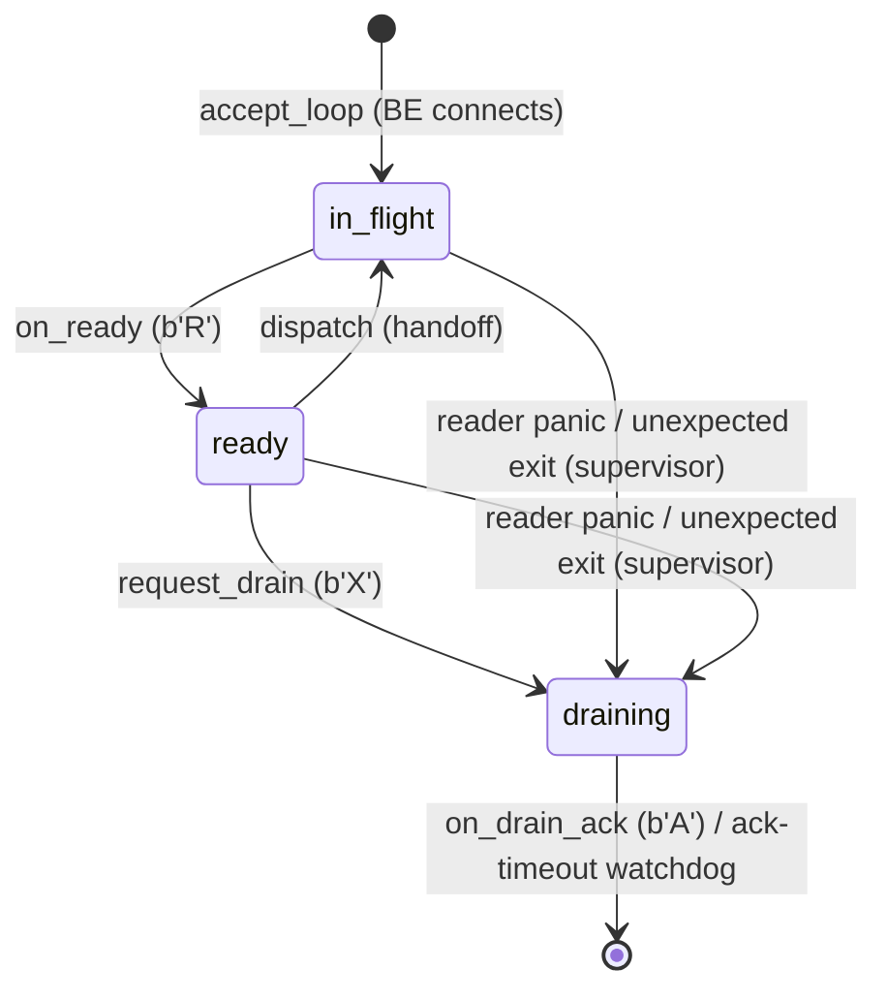

# Slot readiness signaling — demand-driven fd dispatch

> Parent: [README.md](../README.md)
> Sibling: [frontend-handoff.md](../frontend-handoff.md) · [backend-handoff.md](../backend-handoff.md) · [api.md](../api.md)

> **Status: deferred.** This design extends the static
> `pg_transport.backend_pool_size` model with bidirectional UDS ready
> signaling (§1–§4), cooperative drain, and demand-driven autoscaling
> (§5). Un-defer when (a) head-of-line blocking on a busy slot becomes
> observable in real workloads, or (b) an operator hits a sizing
> mistake they cannot restart away. See [roadmap.md §2 Q15](../roadmap.md)
> for the original deferral rationale.
>
> **When implemented, this replaces:** the static slot registration
> in `_PG_init` ([backend-handoff.md §1](../backend-handoff.md)), the
> `BackendPool::start` flow and round-robin `pick_slot` in
> [frontend-handoff.md §2](../frontend-handoff.md), and the
> `backend_pool_size` GUC. Cross-cutting changes are listed in §4.
>
> **Platform scope:** Linux-only. The design assumes Linux SOCK_STREAM
> semantics where 1-byte writes are atomic and never short-write (see
> §2). Portability to other Unixes requires re-verification of UDS
> atomicity, `MSG_NOSIGNAL`, and `SO_PEERCRED` behaviour.

## 0. Problem

The current pool dispatches fds with **blind round-robin**
(`BackendPool::pick_slot`). The frontend has no visibility into which
slots are busy; `send_fd` always succeeds (the kernel buffers the
SCM_RIGHTS message in the receiving socket's buffer) even when the
target slot is mid-session. Consequences:

1. **Head-of-line blocking.** A client whose fd lands on a busy slot
   stalls silently until the slot finishes its current session and
   loops back to `recvmsg`. The stall is unbounded — the client sees
   an open TCP connection but no `ReadyForQuery`.
2. **No backpressure.** When every slot is busy, the frontend keeps
   accepting TCP connections and queueing fds. The client has no way
   to learn it is waiting; PG's usual "too many connections" error
   never fires.
3. **Uneven load.** A slow query on slot 0 doesn't redirect traffic
   to idle slots 1–N. Round-robin assigns the next fd to slot 1
   regardless of whether slot 0 just freed up.

## 1. Design: ready-byte protocol

Make the existing per-slot UDS **bidirectional**. The slot sends a
single-byte `b'R'` message (no SCM_RIGHTS, no ancillary data) to
signal "I am ready for a handoff." The frontend reads these ready
signals and only dispatches to slots that have advertised readiness.

### 1.1 Slot side (sender)

The slot sends `b'R'` to announce readiness and `b'A'` to acknowledge
a drain request. The main loop runs fully under `rt.block_on` so we
get `tokio::select!` cancellation against SIGTERM (see §1.5 for the
async I/O rationale):

```
slot_main:                       // no slot_id argument needed
  let stream = connect(paths::frontend_socket_path())   // one well-known path; see §2.0
  let uds = AsyncFd::new(stream)
  rt.block_on(async {
    loop {
      send_ready_byte_async(&uds).await?      // NEW — b'R'
      tokio::select! {
        _ = shutdown.cancelled() => break,    // SIGTERM → immediate exit
        msg = recv_ctrl_async(&uds) => match msg? {
          CtrlMsg::FdHandoff(fd) => wire::run(fd, ctx).await,
          CtrlMsg::DrainRequest  => {
            cleanup_per_slot_state().await
            send_drain_ack_async(&uds).await? // NEW — b'A'
            break                              // bgworker exits cleanly
          }
          CtrlMsg::Eof           => break,    // FE closed; treat as drain
        }
      }
    }
  })
```

`send_ready_byte_async`/`send_drain_ack_async` are async wrappers
around a non-blocking `libc::send` (one byte, `MSG_NOSIGNAL` so EPIPE
returns as `Err` instead of a signal). If either fails (EPIPE —
frontend died), the slot exits cleanly via the same `break`.

Invariant: the slot has at most one `b'R'` outstanding at any time.
It never sends `b'R'` while it holds a client fd, and it never sends
`b'R'` after sending `b'A'`. The count of unread `b'R'` bytes on the
UDS is always 0 or 1.

### 1.2 Frontend side (receiver)

The frontend tracks each slot's state in **one of three exclusive
containers** — `ready`, `in_flight`, or `draining` (see §5.7 for
the full state representation). The wake-up mechanism is a single
`tokio::sync::Notify` fired whenever a slot enters `ready`.

The frontend spawns one async reader task per slot stream on its
`LocalSet`. Each task reads bytes from the stream and either moves
the slot to `ready` (on `b'R'`) or removes it from `draining` (on
`b'A'`):

```
// Per-slot reader task (spawned in accept_loop, wrapped in panic-catch)
async fn slot_reader(slot_id: u64, stream: UnixStream, pool: Rc<Pool>) {
    let mut buf = [0u8; 1];
    loop {
        match stream.read_exact(&mut buf).await {
            Ok(()) => match buf[0] {
                b'R' => pool.on_ready(slot_id),    // in_flight → ready (or accept_loop → ready)
                b'A' => { pool.on_drain_ack(slot_id); break; }  // draining → gone
                op   => {
                    // Protocol violation: BE sent an opcode we don't
                    // understand. Log so the operator can diagnose;
                    // exit the reader so the slot stops accepting
                    // ready signals from a misbehaving peer. The
                    // per-slot panic-catch (see Reader lifecycle
                    // below) ensures the slot is moved to `draining`
                    // and force-closed when the task ends.
                    log!(WARNING, "slot {slot_id} sent invalid opcode {op:#04x}; closing");
                    break;
                }
            },
            Err(_) => break,  // stream EOF or error (BE exited / FE shutdown)
        }
    }
}
```

`pool.on_ready(slot_id)` is the load-bearing state transition for
the reader. Pseudocode:

```
fn on_ready(slot_id):
    let mut st = pool.state.lock();
    // Slot is either in `in_flight` (post-session b'R') or in the
    // initial accept_loop parking (first b'R' after connect).
    let Some(mut peer) = st.in_flight.remove(&slot_id) else {
        // No-op: slot was concurrently moved to `draining` (rare
        // race — b'X' sent while b'R' was in flight). The stale b'R'
        // is discarded; the b'A' from the BE's drain handler will
        // arrive next and `on_drain_ack` will finish the cleanup.
        return;
    };
    peer.last_ready_at = Instant::now();
    st.ready.insert(slot_id, peer);
    drop(st);                              // release lock BEFORE notify
    pool.has_ready.notify_one();
```

The lock is held for exactly the `remove` + `insert` pair, then
dropped before the wake-up. All four operations happen atomically
from the dispatcher's perspective.

#### Reader lifecycle

The per-slot reader task lives from `accept_loop` spawning it until
the stream closes or the slot exits. Termination paths:

| Trigger | Reader behavior | Pool state |
|---------|-----------------|------------|
| `b'A'` received | `on_drain_ack` removes from `draining`; `break` | Slot gone |
| Stream EOF (BE exited / FE shutdown) | `break` | If slot was in `in_flight` or `draining`, it stays orphaned until force-close — see panic-catch below |
| Unknown opcode | Log WARNING; `break` | Same as EOF |
| Reader task panic | Caught by `tokio::task::JoinSet` wrapper | Pool sees the join failure, moves the slot to `draining`, and force-closes via `shutdown(SHUT_WR)` |

Reader tasks are spawned into a per-pool `JoinSet` so panic-failures
are observable. A supervising task drains `JoinSet::join_next()` in
the background: on a panic or unexpected exit while the slot is
still in `in_flight` or `ready`, the supervisor moves the slot to
`draining` and triggers force-close. This prevents the silent-hang
failure mode where a dead reader leaves a slot stuck in `in_flight`
forever (dispatcher times out; reaper never sees the slot since it
only iterates `ready`).

`pool.on_drain_ack(slot_id)` is correspondingly simple:

```
fn on_drain_ack(slot_id):
    let mut st = pool.state.lock();
    let _peer = st.draining.remove(&slot_id);
    log!("slot {slot_id} drained in {elapsed_ms} ms");
```

### 1.3 Dispatch path

`HandoffSink::handoff` changes from sync fire-and-forget to an
async wait for a slot to enter the `ready` container:

```
Current:  fn handoff(&self, fd, hints) -> Result<()>    // sync, blind round-robin
Proposed: async fn handoff(&self, fd, hints) -> Result<()>  // async, waits for ready slot
```

The implementation:

1. Acquire the pool lock; if `ready` is non-empty, pop one entry,
   insert it into `in_flight`, drop the lock, `send_fd`. Done.
2. Otherwise, loop on `has_ready.notified()` with a deadline of
   `HANDOFF_WAIT` (see §5.1; compile-time constant, not a GUC).
   On wake, re-try step 1.
3. On timeout: return an error. The transport (tcp.rs) sends a PG
   `ErrorResponse("too many connections")` to the client and closes
   the fd, matching vanilla PG's behavior when `max_connections` is
   exhausted.

### 1.4 HandoffSink trait change

The trait becomes async:

```rust
pub trait HandoffSink {
    fn handoff(
        &self,
        fd: OwnedFd,
        hints: HandoffHints,
    ) -> impl Future<Output = anyhow::Result<()>> + '_;
    // OR: use an async_trait / BoxFuture. Since the trait object is
    // behind Rc (not dyn + Send), a BoxLocalFuture works.
}
```

Since `HandoffSink` is used as `Rc<dyn HandoffSink>` (object-safe,
`!Send`), the cleanest approach is to return `BoxFuture<'_, Result<()>>`
(a `Pin<Box<dyn Future + '_>>`). The allocation is negligible — one
Box per connection, dwarfed by the TCP accept + TLS handshake.

`HandoffHandle::handoff` becomes `async fn` correspondingly. The only
caller is `tcp.rs::run_inner`, which is already async.

### 1.5 Async I/O on the UDS

All UDS reads and writes \u2014 `recv_ctrl`, `send_fd`, `send_drain_request`,
`send_ready_byte`, `send_drain_ack` \u2014 should be **async**, on both
FE and BE sides. This is not for throughput (the 1-byte messages
will never block in practice) but for **cancellation**, **executor
cooperation**, and **consistency** with the rest of the codebase.

Why async matters here:

- **Cancellation on shutdown.** A `tokio::select!` between
  `shutdown.cancelled()` and `recv_ctrl_async()` interrupts a
  long-blocking read immediately. The current sync slot loop only
  notices `sigterm_received` between iterations.
- **No executor stalls.** If `sendmsg` ever blocked (corrupt or
  unresponsive peer with full recv buffer), a sync call would freeze
  the entire single-threaded FE LocalSet. Async yields naturally.
- **Reads on the FE are async by necessity.** The reader task
  watches for `b'R'`/`b'A'`; matching the writes async keeps the
  whole UDS protocol coherent.

#### The implementation pattern: `AsyncFd` + non-blocking libc

`tokio::net::UnixStream` does not expose `sendmsg`/`recvmsg` with
ancillary data, so we cannot use its `AsyncRead`/`AsyncWrite`
methods for SCM_RIGHTS. The right primitive is
[`tokio::io::unix::AsyncFd`](https://docs.rs/tokio/latest/tokio/io/unix/struct.AsyncFd.html),
which wraps a raw fd and provides `readable().await` / `writable().await`
guards. The actual syscall is libc with `MSG_DONTWAIT` (or the fd is
set `O_NONBLOCK` once at setup):

```rust
async fn recv_ctrl_async(stream: &AsyncFd<UnixStream>) -> io::Result<CtrlMsg> {
    loop {
        let mut guard = stream.readable().await?;
        match guard.try_io(|inner| {
            // libc::recvmsg(MSG_DONTWAIT) + SCM_RIGHTS parsing
            recv_ctrl_nonblocking(inner.get_ref().as_raw_fd())
        }) {
            Ok(result)        => return result,    // Ok or Err propagated
            Err(_would_block) => continue,         // spurious wake; loop
        }
    }
}

async fn send_fd_async(stream: &AsyncFd<UnixStream>, fd: RawFd) -> io::Result<()> {
    loop {
        let mut guard = stream.writable().await?;
        match guard.try_io(|inner| send_fd_nonblocking(inner.get_ref().as_raw_fd(), fd)) {
            Ok(result)        => return result,
            Err(_would_block) => continue,
        }
    }
}
```

The same pattern wraps `send_ready_byte`, `send_drain_request`, and
`send_drain_ack`. The existing `fd_pass::{send_fd, recv_fd}` helpers
in [fd_pass.rs](../../../crates/core/src/backend/fd_pass.rs) become
their `_nonblocking` variants \u2014 internally identical to today but
with `MSG_DONTWAIT` on the syscall (or relying on `O_NONBLOCK`).

#### BE slot loop becomes fully async

The slot's main loop wraps everything in one `rt.block_on`:

```rust
rt.block_on(async {
    let uds = AsyncFd::new(uds_stream)?;
    loop {
        send_ready_byte_async(&uds).await?;
        tokio::select! {
            _ = shutdown.cancelled() => break,
            msg = recv_ctrl_async(&uds) => match msg? {
                CtrlMsg::FdHandoff(fd)  => wire::run(fd, ctx).await,
                CtrlMsg::DrainRequest   => {
                    cleanup().await;
                    send_drain_ack_async(&uds).await?;
                    break;
                }
                CtrlMsg::Eof            => break,
            }
        }
    }
});
```

`sigterm` now interrupts `recv_ctrl` immediately instead of after
the next iteration.

#### FE side

The dispatcher just `.await`s `send_fd_async` / `send_drain_request_async`.
No `Mutex<PoolState>` is held across these awaits \u2014 the dispatcher
holds the lock only to move the slot from `ready` to `in_flight`,
then drops it before the async write. Same for the reaper.

## 2. UDS message framing

> **Platform assumption.** All single-byte writes/reads described
> below are atomic on Linux SOCK_STREAM (per `man 7 unix`: writes
> shorter than the socket buffer are atomic, never short-write, and
> never block when the peer's recv buffer has space). The
> race-freedom arguments in §2.2 and §5.7 rely on this. POSIX does
> not require these semantics; portability to other Unixes requires
> re-verification.

### 2.0 UDS topology: one listener, one stream per slot

The FE binds **a single UDS listener** at a well-known path. Every
BE bgworker connects to that one path; the FE assigns a monotonic
`slot_id` on each accept. There is no per-slot listener, no per-slot
path, and no `bgw_main_arg` plumbing of slot ids.

| Resource | Lifetime | Count |
|----------|----------|-------|
| Frontend UDS path (e.g. `/tmp/pg_transport_sockets/frontend.sock`) | FE lifetime | **1** |
| `UnixListener` (FE side) | FE lifetime | **1** |
| Connected `UnixStream` (one fd on each side) | Per-slot lifetime | **N** (current pool size) |

All four message types ride on each connected stream:

- BE → FE: `b'R'` (ready), `b'A'` (drain ack)
- FE → BE: `b'\0' + SCM_RIGHTS(fd)` (handoff), `b'X'` (drain request)

The rejected alternative — a separate UDS channel for ready signals
— lives in §6.2.

#### The FE accept loop

The FE runs a long-lived task on its LocalSet. New BE connections
go into the `in_flight` container as a placeholder until the BE's
first `b'R'` arrives, at which point the slot moves to `ready`:

```
async fn accept_loop(listener, pool):
    loop {
        let (stream, _peer) = listener.accept().await?;
        let stream = Arc::new(AsyncFd::new(stream)?);    // shared with reader
        let slot_id = {
            let mut st = pool.state.lock();
            let slot_id = st.next_slot_id();             // monotonic u64
            // Park the new peer in in_flight; the reader will move
            // it to `ready` on the BE's first b'R' (same code path
            // as a post-session b'R'). See §5.7 "in_flight semantics"
            // for why a not-yet-ready BE lives in this container.
            st.in_flight.insert(slot_id, SlotPeer {
                slot_id,
                stream:        Arc::clone(&stream),
                last_ready_at: Instant::now(),
            });
            slot_id
        };
        spawn_slot_reader(slot_id, stream, pool.clone());
    }
```

**Listen backlog.** Snapshot the `max_backend_pool_size` GUC at FE
boot, when `bind()` is called, and pass that value to `listen()`.
SIGHUP raising the GUC later does **not** re-bind — the backlog
stays at the boot-time value. This is acceptable because the
backlog only governs the *transient* queue between `connect()` and
`accept()`, which is microseconds; a slightly-too-small backlog
merely causes brief `EAGAIN`s that `grow_one` retries on. To make
re-bind explicit, future work could close + rebind the listener on
SIGHUP, but it's not required for correctness.

**Cluster discriminator.** Inherited from `paths::slot_dir()`. The
phase-2 hard-coded `/tmp/pg_transport_sockets/` directory is
single-cluster-per-host; multi-cluster hosts need the phase-7
`pg_transport.socket_directory` GUC ([paths.rs](../../../crates/core/src/backend/paths.rs))
to give each cluster its own directory. The filename `frontend.sock`
stays cluster-agnostic; collision avoidance is the directory's job.

#### Differences from the current (static) code

| Aspect | Current code (static pool) | This design (autoscaling, single listener) |
|--------|---------------------------|--------------------------------------------|
| Listeners on FE side | N (one per slot, dropped after accept) | **1** (long-lived) |
| Paths on disk | N (one per slot, kept on disk for the FE's lifetime in case of postmaster respawn) | **1** (`frontend.sock`) |
| slot_id origin | Passed to BE via `bgw_main_arg`, baked into socket path | FE-internal, assigned monotonically on accept |
| `paths::slot_socket_path(slot_id)` | Required — BE constructs its path from the id | Removed — replaced by `paths::frontend_socket_path()` |
| `BackgroundWorkerBuilder::set_argument` | Yes (the slot_id) | No (BE doesn't have an id) |
| Stream used bidirectionally | No — only FE→BE `send_fd` | Yes — BE writes `b'R'`/`b'A'`, FE writes `b'\0'+fd`/`b'X'` |

The single-listener approach is strictly simpler than per-slot
listeners: fewer paths, no `bind_slot_listener` helper, no
`bgw_main_arg` plumbing, no per-listener accept coordination on
concurrent grow calls. The FE-internal `slot_id` exists only for
bookkeeping (HashMap key, log lines).

#### Security

Same as today: filesystem perms (`chmod 0700` on parent dir, `chmod
0600` on `frontend.sock`) plus `SO_PEERCRED` peer-uid check restrict
connects to processes running as the PG cluster user. Only the
postmaster spawns bgworkers as that user, so legitimate connections
are guaranteed to come from our own slot bgworkers. The earlier
design's optional fe_pid-in-path defense isn't materially weakened
(the current `slot.<id>.sock` paths don't include fe_pid either).

### 2.1 Message types

The per-slot UDS carries four message types — two in each direction.
All messages are single-byte; only the fd-handoff carries an SCM_RIGHTS
ancillary cmsg. The byte value is the opcode:

| Direction | Opcode | Meaning | Ancillary |
|-----------|--------|---------|-----------|
| BE → FE | `b'R'` | Ready for next handoff | none |
| BE → FE | `b'A'` | Drain ack ("I have stopped, exiting now") | none |
| FE → BE | `b'\0'` | Fd handoff | SCM_RIGHTS(fd) |
| FE → BE | `b'X'` | Drain request ("please exit after your current session, if any") | none |

`recv_fd` on the BE side is extended to return an enum:

```
enum CtrlMsg {
    FdHandoff(OwnedFd),   // saw b'\0' + SCM_RIGHTS
    DrainRequest,         // saw b'X', no ancillary
    Eof,                  // peer closed (FE crash)
}
```

The FE side's per-slot reader task analogously distinguishes `b'R'`
from `b'A'` by the byte value.

### 2.2 Why the alternation is still race-free

The per-slot UDS is still strictly **lockstep** request-response.
The BE's loop is:

```
send_ready_byte(uds)         // b'R'
match recv_ctrl(uds):
    FdHandoff(fd)   => wire::run(fd); loop
    DrainRequest    => send_drain_ack(uds); exit  // b'A'
    Eof             => exit
```

The BE only ever has 0 or 1 unanswered `b'R'` in flight. After every
`b'R'` the FE replies with exactly one of `b'\0'+fd` or `b'X'`. There
is never more than one in-flight message in either direction. A
`b'X'` written by the FE before the BE has finished its current
session sits harmlessly in the kernel buffer until the BE's next
`recv_ctrl`.

## 3. Error and edge cases

### 3.1 All slots busy, client connects

Frontend's `handoff()` times out → transport sends
`ErrorResponse(ERRCODE_TOO_MANY_CONNECTIONS, "sorry, too many clients
already")` and closes the fd. The client sees the standard PG error.
This is strictly better than the status quo (silent stall).

### 3.2 Slot dies mid-session

The reader task sees EOF on the slot's stream and removes the slot
from the ready pool. On the next `send_fd` attempt (if the slot had
been marked ready before dying), the frontend gets EPIPE and triggers
respawn. No change from current behavior on the crash path.

### 3.3 Slot dies after sending `b'R'` but before `recv_ctrl`

The ready-queue contains a stale slot id. The frontend's `send_fd`
fails with EPIPE, which triggers respawn. The frontend retries
dispatch with the next ready slot (pull another id from the queue).
Cost: one wasted EPIPE round-trip, ~microseconds.

*Scoping note.* This cost is **per-event**, not amortised. Under a
cascading slot-crash scenario (resource exhaustion, OOM-kill
spree, etc.) the dispatcher will retry against newly-spawned slots
and may loop several times before finding a healthy one. Blast
radius is bounded by `max_backend_pool_size`; investigation of
cascades should focus on the cause (whatever is killing slots),
not the EPIPE retry path.

### 3.4 Frontend restart

On frontend restart, `BackendPool::start` re-accepts connections
from all slots. Each slot re-sends its initial `b'R'` on the new
stream. Clean restart, no state leak.

### 3.5 Partial read / short write

Both `b'R'` (1 byte, no ancillary) and `send_fd` (1 byte + SCM_RIGHTS)
are atomic on `SOCK_STREAM` for these sizes. No partial-message
concern.

## 4. Changes required

| File | Change |
|------|--------|
| `crates/api/src/lib.rs` | `HandoffSink::handoff` returns `BoxFuture` (or `async fn`). `HandoffHandle::handoff` becomes `async fn`. |
| `crates/core/src/backend/pool.rs` | Replace `BackendPool` with `Pool { state: Mutex<PoolState>, has_ready: Notify, growing: AtomicBool }`. `PoolState` carries `ready: IndexMap`, `in_flight: HashMap`, `draining: HashMap` (see §5.7). Replace `pick_slot` + sync `send_fd` with `dispatch` that pops from `ready`, moves into `in_flight`, then calls `send_fd`. |
| `crates/core/src/backend/pool.rs` | Spawn the `accept_loop` task on FE boot. It owns the single `UnixListener` and a per-pool `JoinSet<()>` into which each per-slot reader task is spawned. A sibling **reader supervisor** task drains `JoinSet::join_next()`: on a reader exit while its slot is still in `in_flight` or `ready`, move the slot to `draining` and `shutdown(SHUT_WR)` the stream. The supervisor runs for the lifetime of the FE. |
| `crates/core/src/backend/fd_pass.rs` | Add `send_ready_byte(stream_fd) -> io::Result<()>`. Replace `recv_fd` with non-blocking `recv_ctrl_nonblocking` returning `enum CtrlMsg { FdHandoff, DrainRequest, Eof }`. Add non-blocking `send_drain_request` (FE) and `send_drain_ack` (BE) helpers. All write/recv use `MSG_DONTWAIT`. |
| `crates/core/src/backend/fd_pass.rs` (or new `fd_pass/async_io.rs`) | Add `AsyncFd<UnixStream>` wrappers: `recv_ctrl_async`, `send_fd_async`, `send_ready_byte_async`, `send_drain_request_async`, `send_drain_ack_async`. Each loops on `readable()`/`writable()` + `try_io` over the non-blocking libc helpers. See §1.5. |
| `crates/core/src/backend/slot.rs` | Wrap the entire main loop in `rt.block_on(async { ... })`. Use `tokio::select!` with `shutdown.cancelled()` to interrupt `recv_ctrl_async` on SIGTERM. Handle `DrainRequest`: free per-slot caches, send `b'A'`, return cleanly. Connect to `paths::frontend_socket_path()` (no `bgw_main_arg`). |
| `crates/core/src/handoff/tcp.rs` | `.await` on `handle.handoff(fd, hints)`. On timeout error, optionally send `ErrorResponse` before closing fd. |
| tests | Update mock `HandoffSink` impls to return futures. |

Additional changes for autoscaling (§5):

| File | Change |
|------|--------|
| `crates/core/src/backend/pool.rs` | Add `grow_one`/`request_drain` (cooperative), monotonic slot-id counter on `PoolState`. Spawn ack-timeout watchdog per drain that falls back to `shutdown(SHUT_WR)` on `DRAIN_ACK_TIMEOUT`. Replace per-slot-listener `start()` with single-listener `accept_loop` that assigns slot ids on accept. |
| `crates/core/src/backend/pool.rs` | Spawn a per-pool idle-reaper task on an interval timer. |
| `crates/core/src/backend/paths.rs` | Replace `slot_socket_path(slot_id)` with `frontend_socket_path()` returning `slot_dir().join("frontend.sock")`. Multi-cluster collision is the responsibility of `slot_dir()` (phase-7 `pg_transport.socket_directory` GUC). |
| `crates/core/src/lib.rs` | Drop static slot registration from `_PG_init`. Only the FE bgworker is registered statically; all slots are created via `load_dynamic()` from the FE with no `bgw_main_arg`. |
| `crates/core/src/guc.rs` | Replace `pg_transport.backend_pool_size` with `pg_transport.max_backend_pool_size`. |
| `crates/core/src/backend/pool.rs` (pre-warm) | After `accept_loop` is bound, fire `MIN_WARM_SLOTS` parallel `grow_one()` calls. Fire-and-forget; do not wait for the slots to enter `ready`. If `grow_one` fails (e.g. `max_worker_processes` already exhausted at boot), log WARNING and continue with a partial pre-warm — the first client connections will simply pay cold-grow latency or hit `HANDOFF_WAIT`. |
| `crates/core/src/backend/pool.rs` (SIGHUP ceiling) | Add a SIGHUP handler that observes `max_backend_pool_size`. If the new value is **lower** than `ready.len() + in_flight.len() + draining.len()`, kick off `(current - new)` extra `request_drain` calls (prefer `ready` slots first, then mark `in_flight` slots for drain-on-next-`b'R'`). The reaper's idle-timeout path does **not** cover this case because over-ceiling slots may be actively serving. |
| `crates/core/src/backend/slot.rs` | Read no `bgw_main_arg`; connect to `paths::frontend_socket_path()`. Handle `DrainRequest` from `recv_ctrl`: free per-slot caches, send `b'A'`, return cleanly. |

## 5. Autoscaling — single GUC, demand-driven

The pool sizes itself. The operator configures **one** knob,
`pg_transport.max_backend_pool_size` (the ceiling); the frontend grows
on demand when a handoff arrives with no ready slot, and shrinks when
slots have been idle past a threshold. No `set_pool_size` SQL surface,
no per-resize SIGHUP dance, no manual drain.

This supersedes the static `pg_transport.backend_pool_size` GUC.

### 5.1 The single knob

| GUC | Type | Default | Min | Meaning |
|-----|------|---------|-----|---------|
| `pg_transport.max_backend_pool_size` | `int` (SUSET) | 64 | 1 | Hard ceiling. The pool never grows past this. Validation rejects `< 1` (a 0-size pool cannot serve any traffic and would yield a 0 listen-backlog — see §2.0). |

Internal tunables (compile-time constants, not GUCs — keep the
operator surface small). All values are starting points absent
workload measurements; promote to GUCs only if deployment evidence
requires per-cluster tuning.

| Constant | Default | Rationale |
|----------|---------|-----------|
| `IDLE_REAP_AFTER` | 60s | A slot idle for this long is reaped. Long enough to absorb typical workload lulls (per-connection RTT + brief application-side think time); short enough that idle clusters don't squat on bgworker slots. The 60s value is a starting point absent workload data; promote to a GUC if deployments need per-cluster tuning. |
| `IDLE_REAPER_TICK` | 10s | The reaper task wakes every tick to check candidates. |
| `MIN_WARM_SLOTS` | 0 | Floor on pool size. 0 means the cluster can fully quiesce. Set >0 if first-connection latency matters. |
| `GROW_LATENCY_BUDGET` | 100ms | If `grow_one()` can't produce a ready slot within this window (e.g. postmaster is slow to fork), the handoff falls back to waiting on the existing ready-queue. *Estimate; validate post-implementation.* |
| `HANDOFF_WAIT` | 5s | Per-handoff deadline on `has_ready.notified()`. Timeout yields `ErrorResponse(ERRCODE_TOO_MANY_CONNECTIONS)` to the client. |
| `DRAIN_ACK_TIMEOUT` | 60s | Per-drain deadline before force-close. Set conservatively long because a draining slot may be mid long-running query; force-close on a busy slot resets the client connection, which is worse than waiting. |

### 5.2 Grow on demand

**Key insight.** A freshly-spawned slot's *first* `b'R'` and a reused
slot's *post-session* `b'R'` are byte-identical on the same UDS,
handled by the same `slot_reader` code path, and land in the same
`ready` container. The dispatcher treats them as one event source
— "some slot just entered `ready`" — without distinguishing the
cause. This collapses what would otherwise be three branches
(try reuse / await spawn / await reuse-or-saturate) into one race:

```
async fn handoff(fd, hints):
    // Fast path: a slot is already in `ready`.
    {
        let mut st = pool.state.lock();
        if let Some((slot_id, peer)) = st.ready.shift_remove_index(0) {
            let stream = Arc::clone(&peer.stream);   // shared with reader
            st.in_flight.insert(slot_id, peer);      // move ownership back
            drop(st);
            return send_fd_async(&stream, fd).await;
        }
    }

    // No slot is ready. Decide whether to kick off a spawn.
    // `growing` is an AtomicBool guarding at most one *concurrent
    // in-flight* grow per pool. Bounding to 1 caps over-provisioning
    // from a single saturation burst to at most +1 slot; sustained
    // over-provisioning across multiple bursts is bounded only by
    // `max_backend_pool_size`. Use Acquire/Release ordering so the
    // store after grow_one() happens-before the next CAS.
    if current_pool_size() < max_backend_pool_size
       && growing.compare_exchange(false, true, Acquire, Relaxed).is_ok():
        // Fire-and-forget: the new slot's first `b'R'` will land in
        // `ready` and fire `has_ready.notify_one()` exactly like any
        // other ready signal. RAII guard resets `growing` even on
        // panic so a crashed grow_one() doesn't permanently block
        // future grows.
        spawn(async move {
            let _guard = scopeguard::guard((), |_| {
                growing.store(false, Release);
            });
            let _ = grow_one().await;       // logs on failure
        });

    // Single wait point. Resolves with whichever happens first:
    //   (a) an existing busy slot finishes its session and re-enters `ready`,
    //   (b) the newly-spawned slot connects and sends its first b'R',
    //   (c) the timeout fires → saturation → ErrorResponse to client.
    let deadline = Instant::now() + HANDOFF_WAIT;
    loop {
        match timeout_at(deadline, pool.has_ready.notified()).await {
            Ok(()) => {
                // Re-try the fast path. (Spurious wakes are possible
                // because notify_one() is edge-triggered and another
                // handoff may have already taken the slot.)
                let mut st = pool.state.lock();
                if let Some((slot_id, peer)) = st.ready.shift_remove_index(0) {
                    let stream = Arc::clone(&peer.stream);
                    st.in_flight.insert(slot_id, peer);
                    drop(st);
                    return send_fd_async(&stream, fd).await;
                }
                // else: lost the race; keep waiting.
            }
            Err(_) => return Err(SATURATED),
        }
    }
```

Why this is the right shape:

- **One source of truth.** `ready` is the only container the
  dispatcher consults. Whichever path adds a peer to `ready` first
  wins; the dispatcher doesn't care which.
- **Self-load-balancing.** If a busy slot frees up before the
  postmaster forks the new one, the existing slot serves this
  handoff and the new slot becomes warm capacity for the *next*
  arrival. Cold-start latency is paid only when truly necessary.
- **No `await grow_one()` on the hot path.** Slot boot is
  ~tens of milliseconds (postmaster fork + tokio + TLS); blocking
  the handoff future on it would be a regression for the common
  case where another slot frees up in a few hundred microseconds.
- **Bounded concurrent grows.** The `growing` AtomicBool (lives on
  `Pool`, outside `PoolState` so it can be checked without acquiring
  the pool lock — see §5.7) ensures at most one grow is in flight
  at a time. A single burst of N concurrent handoffs into a
  saturated pool adds at most one new slot, not N. Sustained
  over-provisioning across multiple bursts is bounded only by
  `max_backend_pool_size`. Without the flag, races would over-spawn
  but remain correct — the surplus slots become warm capacity and
  are eventually reaped by the idle-reaper. The flag uses
  `compare_exchange(Acquire)` and `store(Release)` so the spawn
  happens-before the next attempt; an RAII guard resets it even if
  `grow_one()` panics.

`grow_one` itself is straightforward and stays fire-and-forget. With
the single-listener topology (§2.0) it's just `load_dynamic` — the
FE's `accept_loop` handles the rest:

```
fn grow_one() -> Result<(), GrowError> {
    BackgroundWorkerBuilder::new("pg_transport slot")
        .set_function("pg_transport_slot_main")
        // No .set_argument — the BE doesn't need a slot_id; the FE
        // assigns one on accept.
        .set_notify_pid(0)                       // detach lifetime
        .load_dynamic()
        .ok_or(GrowError::BgworkerTableFull)?;
    // That's it. The BE will boot, connect to frontend.sock, send
    // b'R'; accept_loop assigns it a slot_id and inserts it into
    // `in_flight`; the reader moves it to `ready` on the b'R` and
    // fires `has_ready.notify_one()`, where a pending `handoff`
    // future picks it up.
    Ok(())
}
```

Note `grow_one` is now **synchronous** and returns the instant
`load_dynamic` succeeds — it doesn't wait for the BE to actually
connect. The eventual first `b'R'` from the new slot fires
`has_ready` asynchronously, where it competes naturally with ready
signals from existing slots. This dovetails with the dispatcher's
single-wait-point design.

Timing budget for a cold grow (*estimates; validate post-implementation*):

| Step | Cost |
|------|------|
| `load_dynamic` (in-process syscall) | microseconds |
| Postmaster forks slot bgworker | ~1 ms (same as default PG fork) |
| Slot connects to `frontend.sock` + builds tokio runtime + TLS acceptor + sends first `b'R'` | ~tens of ms (dominated by tokio + rustls config) |
| **Total: cold first `b'R'` from grow_one entry** | **~20–100 ms** |

This is comparable to default PG's per-connection fork cost. It is
paid by *whichever* handoff happens to be waiting on `has_ready` when
the new slot announces; thanks to the unified queue, that may not be
the handoff that triggered the grow.

#### What if a grow fails?

`grow_one` may fail with `BgworkerTableFull` (max_worker_processes
exhausted), accept timeout (slot crashed before connect), or a bind
error. In all cases the `growing` flag is reset and the dispatcher
sees no `b'R'` from the failed grow. The handoff still has Slow Path
B (wait on existing slots up to `HANDOFF_WAIT`). The failure is
logged at WARNING but doesn't propagate to the client unless the
timeout also fires.

### 5.3 Shrink on idle (reaper + cooperative drain)

Reaping has two phases: **decide** (reaper task picks candidates)
and **drain** (cooperative shutdown handshake with the BE).

#### Decide

A long-running task on the FE LocalSet wakes every `IDLE_REAPER_TICK`:

```
async fn idle_reaper():
    loop:
        sleep(IDLE_REAPER_TICK).await;
        let mut st = pool.state.lock();
        // Snapshot `now` AFTER acquiring the lock so that any
        // starvation on lock acquisition doesn't yield a stale
        // timestamp that would reap recently-active slots.
        let now = Instant::now();
        // Iterate only over `ready` — slots in `in_flight` are
        // serving sessions, slots in `draining` are already exiting.
        let candidates: Vec<u64> = st.ready
            .iter()
            // Defensive: if a clock skew or task-starvation glitch
            // produces last_ready_at > now, treat the slot as fresh.
            .filter(|(_, p)| now > p.last_ready_at
                          && now.duration_since(p.last_ready_at) > IDLE_REAP_AFTER)
            .map(|(id, _)| *id)
            .collect();
        // Respect MIN_WARM_SLOTS floor.
        let keep_n = MIN_WARM_SLOTS.saturating_sub(
            st.ready.len() - candidates.len()
        );
        for slot_id in candidates.into_iter().skip(keep_n):
            request_drain(&mut st, slot_id);
```

The filter is just `now - last_ready_at > IDLE_REAP_AFTER` (plus
the defensive `now > last_ready_at` guard). By construction, slots
in `ready` are neither in-flight nor draining, so no secondary
checks are needed: container membership is the state.

#### Drain (cooperative request/ack)

Reaping is a three-step request/ack/exit handshake, not a unilateral
half-close. The slot is **moved out of `ready` into `draining`** at
the moment the request is sent. After the move, the slot is
invisible to the dispatcher.

```
fn request_drain(st: &mut PoolState, slot_id: u64):
    let peer = st.ready.shift_remove(&slot_id).unwrap();   // safe: caller just
                                                            //   saw it in `ready`
                                                            //   under the same lock
    send_drain_request(&peer.stream);     // FE writes b'X' on UDS (non-blocking)
    st.draining.insert(slot_id, peer);    // ownership moves into draining
    // The stream is still alive (the BE end is still open); the
    // reader task continues to watch for `b'A'` and for stream EOF.
```

*Lock vs. async note.* The `send_drain_request` syscall here runs
synchronously while the pool lock is held, in apparent tension with
§1.5's "all UDS I/O is async" stance. This is a deliberate, narrow
exception: the syscall is non-blocking (`MSG_DONTWAIT`), the
message is one byte with no ancillary data, and bundling it with
the `ready`→`draining` move is what makes the transition atomic
from the dispatcher's perspective. The same exception applies to
the `shutdown(SHUT_WR)` call in the ack-timeout watchdog below.

The BE, on receiving the `b'X'`:

```
match recv_ctrl(uds):
    DrainRequest =>
        // The reaper only sends b'X' to slots in `ready`, which are
        // by construction between sessions — so the slot is idle
        // here. (If a buggy reaper or future code path were to send
        // b'X' to a busy slot, see §5.7(f) for the structural
        // defence-in-depth that keeps the in-flight client safe.)
        // Free per-slot resources: tokio runtime, TLS acceptor,
        // prepared-plan registry, anything cached across handoffs.
        cleanup_per_slot_state();
        send_drain_ack(uds);              // BE writes b'A'
        return Ok(());                    // bgworker exits cleanly
```

The FE reader task, on seeing the `b'A'`:

```
on_drain_ack(slot_id):
    let mut st = pool.state.lock();
    let _peer = st.draining.remove(&slot_id);  // gone for good
    log!("slot {slot_id} drained in {elapsed_ms} ms");
    // reader task exits next iteration when stream returns EOF
    // (BE has exited, kernel closes its end).
```

The state machine is therefore:

```
accept_loop → in_flight  → (first b'R')  → ready  → (dispatch)  → in_flight  → (post-session b'R')  → ready
                                                                                                          ↓  (b'X')
                                                                                                       draining
                                                                                                          ↓  (b'A')
                                                                                                         gone
```

Each transition is a single atomic move under the pool lock. A slot
is in **exactly one** of `ready`, `in_flight`, `draining` at any time.

#### Why cooperative instead of unilateral half-close

An earlier revision used `shutdown(SHUT_WR)` on the FE side to
signal drain (BE saw EOF on next `recv_ctrl`, exited cleanly). That
is technically race-free and uses fewer message types, but the
cooperative variant is preferred because:

- **Explicit drain timing.** The FE knows exactly when the slot
  finished its last session (the moment `b'A'` arrives). Useful for
  metrics ("p50 drain time = X ms") and for diagnosing slow-draining
  slots that are sitting on long-running queries.
- **BE-side cleanup hook.** Between receiving `b'X'` and sending
  `b'A'`, the BE has a clean point to free per-slot caches (prepared
  plans, tokio runtime resources, TLS state). With unilateral
  half-close, BE-side cleanup races with PG's `on_proc_exit` hooks
  on the EOF path; with cooperative drain it's a normal
  control-flow return.
- **Symmetry.** `b'R'` is BE-initiated, `b'\0'+fd` is FE-initiated,
  both have explicit semantics on the wire. Adding `b'X'`/`b'A'`
  keeps the protocol uniform; future control messages (per-slot
  reconfig, TLS cert rotation, observability pulls) slot into the
  same framing.
- **Cleaner observability.** Each transition is a logged byte:
  "sent drain request to slot 7," "slot 7 drained." Half-close gives
  only "stream closed," which conflates intentional drain with BE
  crash.

The cost — one extra round-trip per shrink — is microseconds on a
UDS and only happens when a slot is being reaped (rare, by design).

#### Ack timeout fallback

If the slot is mid-session when `b'X'` arrives, the ack only comes
after `wire::run` returns. A long-running query (or a buggy wire
that spins) could delay the ack indefinitely. The FE protects
against this with a per-drain timer:

```
AFTER request_drain(slot_id):
    spawn(async move {
        sleep(DRAIN_ACK_TIMEOUT).await;   // compile-time constant, e.g. 60s
        let mut st = pool.lock();
        if let Some(peer) = st.draining.remove(&slot_id) {
            // Ack never arrived. Fall back to force-close: half-close
            // the FE write half, which interrupts the BE's next UDS
            // read with EOF and lets PG's bgworker exit machinery
            // reap the process.
            let _ = shutdown(peer.stream.as_raw_fd(), SHUT_WR);
            log!(WARNING, "slot {slot_id} drain ack timeout; force-closed");
        }
        // If draining.remove returned None, the ack already arrived
        // and on_drain_ack cleaned up — nothing to do.
    });
```

Force-close is the rare failure mode, not the happy path. The slot
eventually notices EOF on its next `recv_ctrl` and exits via the
`Eof` branch.

#### Slot lifetime under cooperative drain

```
fork → connect → send b'R' → recv_ctrl → [FdHandoff(fd) → wire::run → send b'R' → ...]*
                                       └→ DrainRequest → cleanup → send b'A' → exit
```

The reaper picks provably-idle slots, so in the common case the
`b'X'` is processed on the very next `recv_ctrl` iteration. No
mid-session interruption is possible (see §5.7(f) for the structural
guarantee).

### 5.4 Removal of static slot registration

Today `_PG_init` registers `backend_pool_size` slots statically. With
autoscaling, the pool starts at `MIN_WARM_SLOTS` (default 0) and
grows on demand. `_PG_init` registers **only** the FE bgworker:

```rust
// crates/core/src/lib.rs (after change)
BackgroundWorkerBuilder::new("pg_transport frontend").load();
// No slot loop here. All slots are dynamic.
```

The FE bgworker, after boot, optionally pre-warms `MIN_WARM_SLOTS`
slots via `grow_one` so the first arriving connection doesn't pay
slot-boot latency. Pre-warm is fire-and-forget: fire all
`MIN_WARM_SLOTS` `grow_one()` calls in parallel and return; do not
block FE startup on the slots actually connecting. Partial pre-warm
(some `grow_one()` failures) is logged at WARNING but is not fatal
— missing slots will be created lazily on first demand. See the
§4 changes-required entry for details.

Tradeoff: this means there are zero slot bgworkers running in an
idle cluster, which is the operator-friendly default (no resident
RAM cost for unused capacity). The first connection after idle pays
the grow cost, the second onwards is fast.

### 5.5 Saturation behavior

When `current_pool_size == max` and all slots are busy:

1. New handoff hits Slow Path B in §5.2.
2. Waits up to `HANDOFF_WAIT` (5s default, same as proposed in §1.3).
3. On timeout: transport returns `ErrorResponse(ERRCODE_TOO_MANY_CONNECTIONS)`.

The ceiling is `max_backend_pool_size` directly; there's no
overprovisioning or queueing beyond the in-flight requests waiting on
`has_ready`. This is a deliberate cap: it gives the operator a hard
guarantee of bgworker footprint regardless of load.

### 5.6 Failure modes (autoscaling-specific)

| Scenario | Behavior |
|----------|----------|
| `max_worker_processes` exhausted mid-grow | `grow_one` returns `BgworkerTableFull`; handoff falls back to waiting on existing slots. Logged at WARNING with a hint to bump `max_worker_processes`. No FATAL. |
| Postmaster restart with non-zero `MIN_WARM_SLOTS` | New postmaster restarts the FE; FE pre-warms `MIN_WARM_SLOTS` from a clean slate. All previous dynamic slots are gone. |
| Reaper task panics | Caught at the LocalSet boundary; the FE logs WARNING and respawns the reaper. Pool stays at its current size until the reaper resumes. |
| Pool size > max via SIGHUP lowering `max_backend_pool_size` | Dedicated SIGHUP handler (see §4) drains `(current - new)` slots: idle slots in `ready` first via `request_drain`, then `in_flight` slots marked for drain-on-next-`b'R'`. The idle-reaper does **not** cover this case because over-ceiling slots may be actively serving. |
| Two handoffs race grow when one slot away from max | Mutex-serialized in `grow_one`; the loser re-checks `ready`, may take the winner's slot, may grow if still under max. |
| FE crashes with dynamic slots running | Slots' `recv_ctrl` returns `Eof`, slots exit cleanly via the `Eof` branch. Postmaster restarts FE; FE has zero peers and rebuilds from scratch. |
| Slot stuck in long-running query during drain | `b'A'` ack delayed. After `DRAIN_ACK_TIMEOUT` (compile-time, e.g. 60s) the FE force-closes via `shutdown(SHUT_WR)` and logs WARNING. Client in the long query sees its session run to completion only if the wire layer is responsive to BE shutdown; otherwise TCP reset on force-close. |

### 5.7 Race-freedom: grow_one vs cooperative drain vs dispatch

The autoscaler runs six concurrent actors against shared state:

| Actor | Frequency | Mutates |
|-------|-----------|---------|
| `handoff()` (dispatch) | per client connection | moves slot from `ready` to `in_flight`, calls `send_fd` outside the lock |
| `grow_one()` | per saturation event | calls `load_dynamic()` — no shared-state mutation |
| `accept_loop()` (single-listener accept task, §2.0) | per BE connect | allocates `slot_id`, inserts into `in_flight` as a placeholder, spawns reader |
| `request_drain()` (reaper) | every `IDLE_REAPER_TICK` | **moves** slot from `ready` to `draining`, sends `b'X'` (FE → BE) |
| `on_drain_ack()` (reader, on `b'A'`) | per drain | removes slot from `draining` |
| `on_ready()` (reader, on `b'R'`) | per session boundary | moves slot from `in_flight` to `ready`, stamps `last_ready_at`, fires `has_ready.notify_one()` |
| Reader supervisor (`JoinSet` drain task) | per reader task termination | if reader exited unexpectedly with the slot still in `in_flight` or `ready`, moves to `draining` and force-closes the stream |

Note the split between `grow_one` (which only calls `load_dynamic`
and returns) and `accept_loop` (which actually inserts the new
`SlotPeer` into `in_flight` when the BE connects). With the single
listener of §2.0, slot-id allocation is owned by `accept_loop`, not
by `grow_one`.

#### State diagram

A slot moves through three transient states, in exactly one
container at any moment:



Legal transitions only:

| From | To | Trigger | Actor |
|------|----|---------| ------|
| (none) | `in_flight` | BE connects | `accept_loop` |
| `in_flight` | `ready` | b'R' from BE | `on_ready` (reader) |
| `ready` | `in_flight` | dispatch | `handoff` |
| `ready` | `draining` | reaper picks idle slot | `request_drain` |
| `draining` | gone | b'A' from BE, OR `DRAIN_ACK_TIMEOUT` watchdog | `on_drain_ack` / watchdog |
| any | `draining` | reader panic / unexpected exit | reader supervisor |

Illegal transitions (caught by panic or assertion):

- `in_flight` → `draining` (must transit `ready`; reaper only picks from `ready`)
- `in_flight` → (none): a slot never disappears while in flight; it must be drained
- `ready` → (none): direct removal without ack is force-close only (watchdog path, not normal)

#### Invariants

The design rests on three invariants. If these hold, no interleaving
of the actors can produce an incorrect state (lost handoff, double
dispatch, sent-fd-to-dead-slot, etc.):

1. **Slot ids are monotonic and never reused.** A `u64` counter in
   `PoolState`, bumped under the lock by `accept_loop` (not by
   `grow_one`). A stale `slot_id` referenced by a wake-up signal
   from a long-dead slot can never accidentally route to a fresh
   slot. The counter is `u64` (not `u32`) so wraparound is
   practically impossible — at 1M slot allocations per second,
   wraparound takes ~585,000 years.

2. **A slot is in exactly one container at any time.** `ready`,
   `in_flight`, and `draining` partition the live slot set.
   Container membership *is* the state. There is no shadow flag,
   no "alive in X but draining" combination. Every transition is
   a single atomic move under the pool lock.

3. **The dispatcher only consults `ready`.** Dispatch is
   `ready.shift_remove_index(0) + in_flight.insert(id, peer)` under
   the lock. It cannot accidentally select an in-flight or draining
   slot, by construction.

#### State representation: three containers, one wake-up channel

A slot moves through three transient states during its life:
**ready** (waiting to be dispatched), **in-flight** (serving a
session or just-accepted, awaiting first `b'R'`), and **draining**
(sent `b'X'`, awaiting `b'A'`). Each state is a separate container
in `PoolState`; transitions are atomic moves under the pool lock:

```
struct PoolState {
    ready:           IndexMap<u64, SlotPeer>,    // FIFO insertion order
    in_flight:       HashMap<u64, SlotPeer>,
    draining:        HashMap<u64, SlotPeer>,
    slot_id_counter: u64,                        // u64 so wraparound is practically impossible
}

struct SlotPeer {
    slot_id:       u64,
    stream:        Arc<AsyncFd<UnixStream>>,     // shared between dispatcher,
                                                 //   reader, and drain watchdog
    last_ready_at: Instant,
}

struct Pool {
    state:     Mutex<PoolState>,
    has_ready: Notify,                           // edge-triggered: fires when something enters `ready`
    growing:   AtomicBool,                       // "a grow_one is in flight"; outside the Mutex
                                                 //   so the §5.2 CAS path can check it without
                                                 //   acquiring the pool lock
}
```

**`in_flight` semantics.** The name is slightly overloaded: it
covers both "actively serving a session" *and* "freshly accepted,
awaiting first `b'R'`". Both states share the same dispatcher
invariant — the slot is not currently dispatchable — so collapsing
them is correct. A future refactor could split into
`pending: HashMap` (not-yet-ready BE) + `in_flight: HashMap`
(serving) if introspection benefits from the distinction; the
transition table and lock discipline would be unchanged.

The dispatcher waits on `has_ready` and re-tries the fast path on
each wake. `IndexMap` gives FIFO fairness on `ready`: the slot that
became ready first gets the next handoff (insertion-ordered
iteration), with O(1) `shift_remove_index(0)` for pop-front.

**Why three containers + Notify** instead of a single `peers` map
with flags? Three reasons:

- **Structural exclusivity.** A slot is *in* `ready` xor `in_flight`
  xor `draining`. The compiler enforces it; there is no flag to
  forget to check.
- **Trivial reaper.** Iterating over `ready` is iterating over
  reapable candidates. No `!in_flight` or `!draining` filter.
- **Direct introspection.** `ready.len()`, `in_flight.len()`,
  `draining.len()` give the operator counts without scans. A future
  `pg_transport.slots()` SQL function maps each container to a
  `state` column.

The asymmetric alternative (one `peers` map + `in_flight: bool` +
mpsc) is slightly cheaper on the hot path (one HashMap mutation per
dispatch instead of two; mpsc bundles queue + wake-up) but couples
state across primitives and requires the dispatcher to do a
secondary `!draining` check. For a research framework where
clarity matters more than per-dispatch microseconds, the three
containers win.

#### Lock discipline

A single `Mutex<PoolState>` (or `parking_lot::Mutex` for a cheaper
uncontended path) protects all container mutations. Critical
sections are tiny (IndexMap/HashMap operations); syscalls held
under the lock are `send_drain_request` in `request_drain` and the
fallback `shutdown(SHUT_WR)` in the ack-timeout watchdog, both
non-blocking and microseconds. `send_fd` is released **outside** the
lock to keep dispatch concurrent.

#### Walkthrough: the interesting interleavings

**(a) Dispatch races reaper for a ready slot.**

```
T0: reader fires has_ready.notify_one() after moving X to `ready`
T1: reaper acquires lock, iterates `ready`, sees X idle 60s → candidate
T2: reaper moves X from `ready` to `draining`, sends b'X', drops lock
T3: pending handoff wakes from notify, acquires lock
T4: handoff sees `ready` empty (or some other slot Y) → either picks Y or loops on notify
```

Safe — invariants (2) and (3). The dispatcher only looks in
`ready`; the reaper has already moved X out. The dispatcher's wake
was spurious but harmless. The dispatch path is:

```
loop {
    has_ready.notified().await;          // wake on any ready event
    let (slot_id, stream) = {
        let mut st = pool.state.lock();
        match st.ready.shift_remove_index(0) {
            Some((id, peer)) => {
                let stream = Arc::clone(&peer.stream);
                st.in_flight.insert(id, peer);
                (id, stream)
            }
            None => continue,   // spurious wake; loop
        }
    };
    send_fd_async(&stream, client_fd).await?;    // syscall, no lock held
    break;
}
```

**(b) Dispatcher and reaper target the same slot.**

Cannot happen by construction. The reaper iterates `ready`; the
dispatcher pops from `ready`. Both take the pool lock, so they
serialize. Whichever acquires first wins; the loser sees a different
state when it acquires. There is no shared-target race because the
slot can only be in one container at a time.

**(c) Concurrent grow_one calls (covered in §5.2).**

`Pool.growing: AtomicBool` (outside the lock) gates entry: at most
one grow at a time. Losing caller falls through to
`has_ready.notified()`. Safe by construction.

**(d) grow_one and request_drain run concurrently.**

They mutate disjoint state:

- `grow_one` only calls `load_dynamic` (touches PG bgworker table,
  not `PoolState`).
- `request_drain` moves an existing slot from `ready` to `draining`
  under the pool lock.

No lock contention beyond brief serialization on `pool.state.lock()`.
No nested locks. The newly-spawned BE eventually connects and the
`accept_loop` inserts it into `in_flight` under the same lock —
which serializes harmlessly with any concurrent `request_drain`.

**(e) Reader receives `b'R'` for slot X while request_drain is sending b'X' to X.**

```
T0: slot X finishes a session, writes b'R' to the UDS
T1: reaper acquires lock, iterates `ready` (X is not there — X is in `in_flight`),
    so X is NOT a candidate. Reaper picks a different idle slot or nothing.
```

Wait — this case is structurally impossible. If the reader hasn't
processed X's `b'R'` yet, X is still in `in_flight`, and the reaper
can't see it as a candidate. The reaper would have to wait for the
reader to move X to `ready` before considering it. Once X is in
`ready`, dispatcher and reaper both take the lock, and only one
wins. Safe by structural exclusivity.

The equivalent race in the asymmetric design (where the reaper sees
a `peers` entry with `in_flight=false` but the dispatcher is about
to pull it from mpsc) doesn't exist here: there is no state where
the slot is simultaneously "in `ready`" and "being dispatched."

**(f) Reaper sends b'X' to a slot mid-session (hypothetical bug).**

Cannot happen via the documented code path: the reaper iterates
`ready`, and an in-session slot is in `in_flight`, not `ready`. But
as a defence-in-depth argument: even if a buggy reaper *did* send
`b'X'` to a slot whose underlying BE is mid-session, the in-flight
client connection would still complete safely. The slot's main loop
only reads from the UDS at one point: `recv_ctrl`. And `recv_ctrl`
is only called when the slot is **idle, between sessions**. While
the slot is in `wire::run`, it is reading/writing the **client TCP
fd**, not the UDS:

```
slot loop:
    loop {
        send_ready_byte(uds)        // BE → FE
        match recv_ctrl(uds) {       // ← the only UDS read, only when idle
            FdHandoff(fd) => wire::run(fd);  // reads client TCP, ignores UDS
            DrainRequest  => { cleanup(); send_drain_ack(uds); exit }
            Eof           => exit
        }
    }
```

So a buggy `b'X'` or `SHUT_WR` on a busy slot has zero observable
effect on the running session; the slot doesn't notice the UDS
message until it loops back to `recv_ctrl`, at which point it sees
the drain (or `Eof`) and exits cleanly. The worst-case consequence
of any reaper bug is "one extra `grow_one` is paid later" — never
"client connection dropped."

#### What goes wrong without these invariants

| Missing invariant | Failure mode |
|-------------------|--------------|
| Slot id reuse (no monotonic counter) | A stale wake-up signal from a long-dead slot could route a client fd to a freshly-spawned different slot that happens to share the id. |
| Non-atomic move on `b'R'` arrival (insert into `ready` without removing from `in_flight`) | Slot appears in two containers; the reaper might mistake an in-flight slot for an idle ready one. |
| Non-atomic move on `b'X'` send (remove from `ready` without inserting into `draining`) | Slot in neither container → reader can't observe the ack, peer leaks. |
| Dispatcher looks in `in_flight` instead of `ready` | Two concurrent dispatches could target the same slot → double `send_fd` to one BE, fd lost. |

#### Why no per-slot locks

A single `Mutex<PoolState>` is simpler than per-slot locks and the
hot path (uncontended dispatch) is microseconds. Per-slot locks
would add nesting hazards (dispatch needs lock-on-container to find
the slot, then lock-on-slot to mutate it) for no practical gain at
our scale (pool size O(100)).

### 5.8 What the operator sees

```
# postgresql.conf
shared_preload_libraries     = 'pg_transport'
max_worker_processes         = 128                # hard kernel ceiling
pg_transport.max_backend_pool_size = 64           # framework ceiling
pg_transport.auth_source     = 'pg_hba'
```

No more "I sized the pool wrong, let me restart PG." The pool grows
with traffic and shrinks back when traffic subsides. The only
manual sizing decision is the ceiling, which is a capacity-planning
question (how much work do I want PG to be able to do at peak?),
not a tuning question.

## 6. Rejected alternatives

### 6.1 Shared-memory atomic flag per slot

Each slot sets an atomic `IDLE` flag; the frontend polls the flags.
Rejected: polling is wasteful or introduces latency (sleep between
polls). The UDS ready-byte is event-driven with zero polling.

### 6.2 Separate ready channel (second UDS or pipe per slot)

Adds socket count, fd management, and setup complexity for no benefit.
The existing per-slot UDS is already connected and long-lived; making
it bidirectional is free.

### 6.3 Frontend-side tracking via EPIPE probing

Send a speculative `send_fd` and retry on EPIPE. Doesn't solve the
busy-slot problem (EPIPE means dead, not busy). The fd has already
been dup'd into the dead slot's former process; the client fd is
wasted.

### 6.4 Readiness via `SO_PEERCRED` / procfs slot-state polling

Inspect `/proc/<slot_pid>/status` or similar to detect idle slots.
Fragile, Linux-only, and still requires polling.
